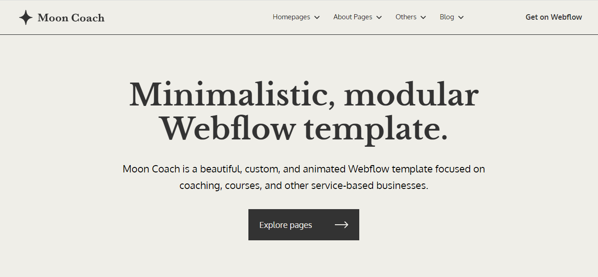

# Layout for a website specialized in website templates

___

You can try it out **[here](https://enamoredevil.github.io/layout_for_website_with_templates/)**
___

### features:

 >modal boxes 

 >dropdown menu

 >slider with images made with Swiper.JS

 >other slight features for convenience 
___
### preview: 
